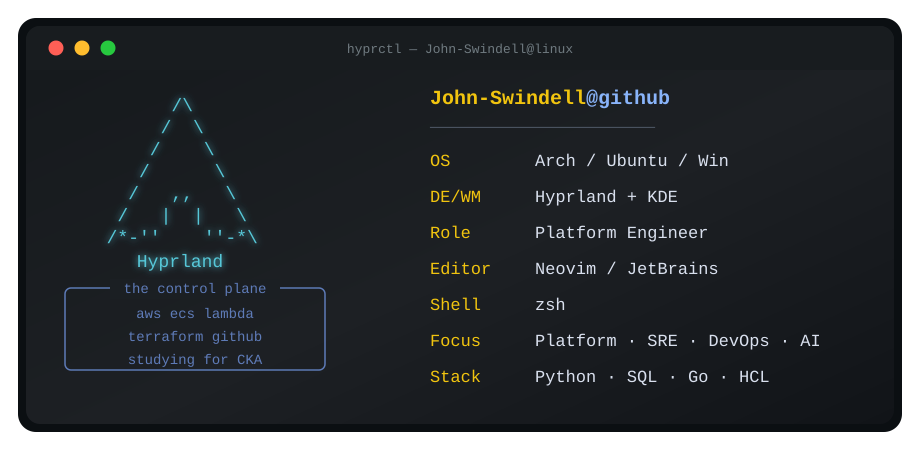

  

# Hey, I'm John

I am a Platform Engineer at the Florida Panthers, embedded with the Business Intelligence team.

I build practical platform systems where data, cloud infrastructure, internal tooling, and AI-assisted work meet. My current focus is cloud infrastructure, internal platforms, and turning fast prototypes into reliable software that technical and non-technical teams can use.

Currently:

- Owning platform engineering and infrastructure as code for the Florida Panthers Business Intelligence team.
- Building AWS-backed application templates and delivery paths for internal tools.
- Putting QuickSight assets in version control with drift detection, validation, and controlled publishing.
- Building governed RAG and MCP systems for internal data.
- Deepening Go and Kubernetes fundamentals while preparing for the CKA.
- Keeping a Linux-heavy workflow across Arch, Ubuntu, KDE, Hyprland, Docker, and self-hosted tooling.

## Technical Focus

- **Internal Platforms:** Governed application templates, developer environments, Entra ID, Cognito, IAM, RAG, and MCP
- **Cloud & DevOps:** AWS, GCP, ECS/Fargate, Lambda, S3, CloudFront, Terraform, GitHub Actions, Linux, and Bash
- **Data & Analytics:** QuickSight, Redshift, SPICE, Python, Pandas, validation tooling, and point-in-time pipelines
- **Backend & Tools:** FastAPI, SQL, JavaScript, Java, Go fundamentals, automation scripts, and CI/CD

## Stack

  
  
  
  
  
  
  
  
  
  
  
  
  
  
  
  
  
  
  
  
  

## Featured Work

| Project | What it shows | Stack |
| :--- | :--- | :--- |
| **[Internal Application Platform](https://jswindell.dev/blogs/internal-application-platform/)** | A narrow AWS path that turns internal prototypes into authenticated, deployable applications. | AWS, Terraform, GitHub Actions, Entra ID, Cognito |
| **[QuickSight Version Control](https://jswindell.dev/blogs/quicksight-gitops/)** | Scheduled exports, pull requests, schema-aware validation, rollback, and controlled publishing for QuickSight assets. | QuickSight, GitHub Actions, Python, AWS IAM |
| **[Ellide](https://ellide.co/)** | Personal AI project that turns syllabi, slides, scanned readings, and handouts into AI-ready teaching materials grounded in source context. | OCR, LLM workflows, Markdown/JSON, RAG context, product engineering |
| **[AI-Driven Onboarding Platform](https://jswindell.dev/blogs/automated-onboarding/)** | Production-critical onboarding workflow connecting Airtable, DocuSign, Google Workspace, GitHub Actions, and Gemini-generated LMS curriculum. | Python, GCP Cloud Run, GitHub Actions, Gemini, DocuSign, Airtable |
| **[Quantitative ETL Pipeline](https://jswindell.dev/blogs/data-pipeline/)** | GCP-backed data pipeline with multi-source ingestion, two-tier caching, validation gates, and point-in-time architecture for research workflows. | Python, Docker, GCP, GCS, Pandas, data validation |
| **[AI Dungeon Crawler / Capstone](https://github.com/John-Swindell/rag-dungeon-crawler)** | Legacy CLI game rebuilt as a containerized FastAPI application with procedural maps, persistent state, Terraform, MongoDB Atlas, and AI-assisted narrative context. | Python, FastAPI, Docker, Terraform, MongoDB, Gemini |
| **[ML Strategy Validation](https://jswindell.dev/blogs/quant-momentum-research/)** | Research framework using walk-forward validation, SHAP diagnostics, and QuantStats to evaluate strategy risk before production promotion. | Python, CatBoost, Scikit-Learn, QuantStats, SHAP |

### Worth Checking if You're Curious
- [`boot-progress`](https://github.com/John-Swindell/boot-progress): DevOps path learning progress from Boot.dev, though, I am mostly focused on Go and practical implementation.
- [`Portfolio-SQL-Schema`](https://github.com/John-Swindell/Portfolio-SQL-Schema): Very early project of mine, but it has some nice visuals.

## Connect

  
  &nbsp;&nbsp;
  
  &nbsp;&nbsp;
  
  &nbsp;&nbsp;
  

