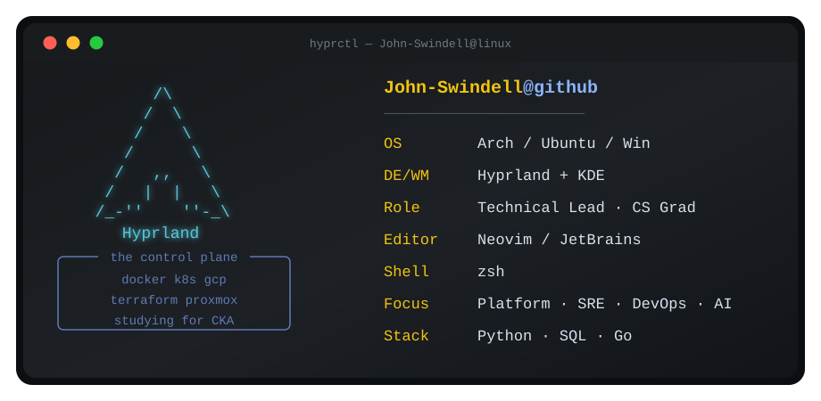

  

<h1 align="left">Hey, I'm John</h1>

  I am a Technical Lead @ Tekly Studio.  
  I work in cloud, data, automation, and LLM integration in production environments.

###

<h2 align="left">Technical Stack</h2>

  
  
  
  
  
  
  
  
  
  

  
  
  
  
  
  
  
  

  
  
  

###

<h2 align="left">Featured Projects</h2>

| Project | Description | Stack |
| :--- | :--- | :--- |
| **[AI-Driven Onboarding LMS](https://jswindell.dev/blogs/automated-onboarding/)** | A headless LMS using the Gemini API to ingest internal wikis and synthesize role-specific curriculum. | Python, Gemini API, Google Workspace, OpenAI API |
| **[ML Strategy Validation](https://jswindell.dev/blogs/quant-momentum-research/)** | Signal Funnel diagnostic architecture using QuantStats and SHAP to disqualify high-risk trading strategies. | Python, Scikit-Learn, CatBoost, Ta-lib |
| **[Quantitative ETL Pipeline](https://jswindell.dev/blogs/data-pipeline/)** | Survivorship-bias-free data pipeline on GCP with a custom two-tier caching strategy (Local + Cloud). | Python, Docker, GCP, Pandas, Numpy|
| **[Comic Book Scraper Bot](https://jswindell.dev/blogs/comic-scraper-bot/)** | A specialized Discord bot designed to track real-time inventory changes for limited-edition comic book variants.  | Python, BS4, Asyncio, Discord API |

###

<h3 align="left">Connect with me</h3>

  
  &nbsp;&nbsp;
  
  &nbsp;&nbsp;
  

